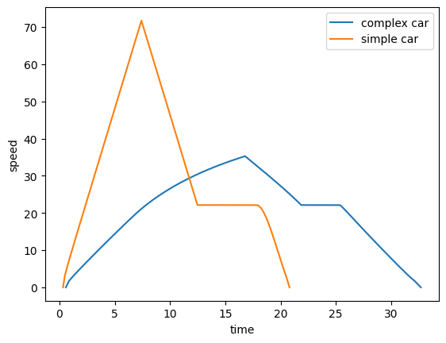

# RACE CAR SIMULATOR

this is a small python toolkit to simulate race cars using the steady state. it supports custom tracks, friction, engine limitations, torque curves, air drag, and gives gives extensive data for analysis and visualization. 

this README will discuss the API of the toolkit and then the math powering the simulation

### SECTIONS
[api](#api)
<br> > [tracks](#tracks)
<br> > [cars](#cars)
<br> > [analysis](#analysis) 
<br> [math](#math)
<br> > [speed at constraints](#speed-at-constraints)
<br> > [expanding from constraints](#expanding-from-constraints)
<br> > [engine](#engine)
<br> > [drag](#drag)
<br> > [lap time](#lap-time)


## API

### TRACKS
we assume left/right symmetry, so race tracks can be abstracted to the radius of curvature as a function of distance. 

create tracks like so:

```python
import numpy as np
from matplotlib import pyplot as plt
from rxtrack import rxTrack

my_track = rxTrack(dx=0.5) # dx is the resolution of the simulation

# create the J track
my_track.add_straight_section(500)
my_track.add_circular_section(50, np.pi * 50)

# add stops at the start and end of the track
my_track.add_start_end_constraints()
```
...or like so:
```python
from rxTrack import ExampleTracks
other_track = ExampleTracks.j_track
```
### CARS

create cars like so:

```python
from car import Car

complex_car = Car(
                m=300, 
                mu_x=1, 
                mu_y=1, 
                sim_engine = True, 
                drive_ratio = 4.0, 
                r_wheel = 0.254, 
                torque_csv = "torque_curve_data.csv",
                drag_coef = 0.3,
                frontal_area = 1.0,
                rho_air = 1.225
            )
```

or like so:

```python
simple_car = Car(300, 1, 1)
```

### ANALYSIS

solve like so:

```python
output = track.solve(complex_car)
print(output["lap_time"])
>>> 32.692785687048264
```
output is a dictionary with many interesting values. 

full list:
```
"lap_time" - total time
"v(i)" - indexed speed
"a_x(i)" - indexed forward/backward acceleration
"a_y(i)" - indexed left/right acceleration, not signed
"x_axis" - for plotting things w.r.t. distance
"t_axis" - for plotting things w.r.t. time
```

for example, let's compare the complex and the simple car. we'll plot their speeds against time. to do that, we use the "t_axis" table as our x axis, and "v(i)" table as our y axis.

```python
output_complex = track.solve(complex_car)
output_simple = track.solve(simple_car)

plt.plot(output_complex["t_axis"], output_complex["v(i)"], label="complex car")
plt.plot(output_simple["t_axis"], output_simple["v(i)"], label="simple car")

plt.ylabel("speed")
plt.xlabel("time")
plt.legend()
plt.show()
```



## MATH

### SPEED AT CONSTRAINTS

a "constraint" is somewhere where there could be a local minimum of speed ($a_x = 0$). this looks like a local minimum of radius of curvature or the start and the stop of the track.

for constraints which are not stop points ($v=0$), we solve using friction bounds:

$a_x = 0 \implies a_y = \mu_yg = \frac{v^2}{r} \implies v = \sqrt{\mu_y rg}$

this changes under air drag! we'll deal with that later.

### EXPANDING FROM CONSTRAINTS

consider speed $v$ to be a function of distance $x$, $v(x)$. while we have speed at the constraint points, we'd like to expand outward. we write the following: 

$v(x + dx) = \sqrt{v_0^2 + 2 a_x dx}$

to find $a_x$, we assume friction's 'pareto efficiency' lies on an ellipse:

$\left(\frac{a_x}{\mu_x g}\right)^2 + \left(\frac{a_y}{\mu_y g}\right)^2 = 1$

we know $a_y = \frac{v_0^2}{r}$:

$a_x = \mu_x g \sqrt{1 - \left(\frac{v_0^2}{r \mu_y g}\right)^2}$

### ENGINE

the above is actually $a_{x,\text{friction}}$. when simulating an engine, the real forward acceleration is:

$a_x = \min(a_{x,\text{engine}}, a_{x,\text{friction}})$

this is just $a_{x,friction}$ bounded from above by the limitations of our engine.

$a_{x,engine}$ is the maximum possible acceleration provided by our engine. consider torque as a function of motor speed $\tau (\omega _{motor}).$

$a_{x,engine} = \frac{F_{engine}}{m} = \frac{\tau({\omega_{motor}})}{mr_{wheel}} $

and we get it as a function of speed $v$ using the following relation, with drive ratio $D$: 

$\omega_{motor} = D \omega_{wheel} = D \frac{v}{r_{wheel}}$

### DRAG

our earlier calculated constraint speeds are wrong because of drag. why? we assumed $a_x = 0 \implies F_{x,friction}=0$. under air drag, we need to "allocate" some of our friction in the forward/backward direction to cancel out drag.

we write:

$a_x = kv^2$

where $k$ is the total drag coefficient ($F_{drag}=mkv^2$). using the elliptical assumption, and solving again:

$v = \frac{\sqrt{\mu_y g r}}{\sqrt[4]{1 + \left(\frac{\mu_y r k}{\mu_x}\right)^2}}$

tip: sanity check this by sending $k \rightarrow 0 $ and verifying that the earlier result $\sqrt{\mu_y rg}$ is obtained

during expansion, we make the simple modification:

$a_x \rightarrow a_x -kv^2$

or, when we are expanding backwards ("decelerating"),

$a_x \rightarrow a_x + kv^2$

NOTE: technically, i think that the constraint points' locations should be changed under drag. but this effect is ignored for this project

### LAP TIME

after expanding from all constraints, we take the minimum speed at each point. lap time is then:

$t = \sum \frac{dx}{v}$

EDGE CASE ALERT!!! EDGE CASE ALERT!!!

if you just do this, your estimates will be off by quite a bit for large $dx$. smaller $dx$ will be better, but can we make the convergence faster?

there are some points where $v=0$, namely the start and the end. it just so happens that small $v$ points are also the most important, as they contribute most to the time.

my solution: suppose at the start, $x=0$, $v(0)=0$. then assume we accelerated uniformly to $v(0+dx)$, making the average speed $\frac{v(0) + v(0+dx)}{2} = \frac{v(dx)}{2}$, making our estimate of the time $\frac{2dx}{v(dx)}$. similarly, for the ending, $x=x_f$, just use $v(x_f-dx)$.